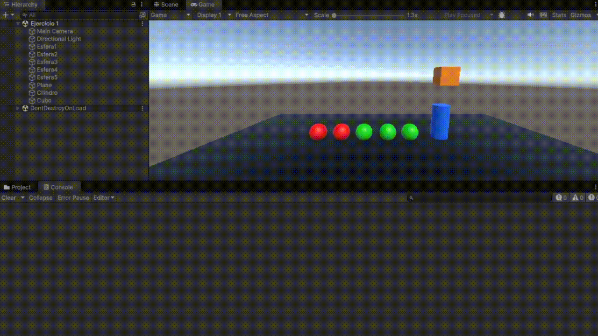
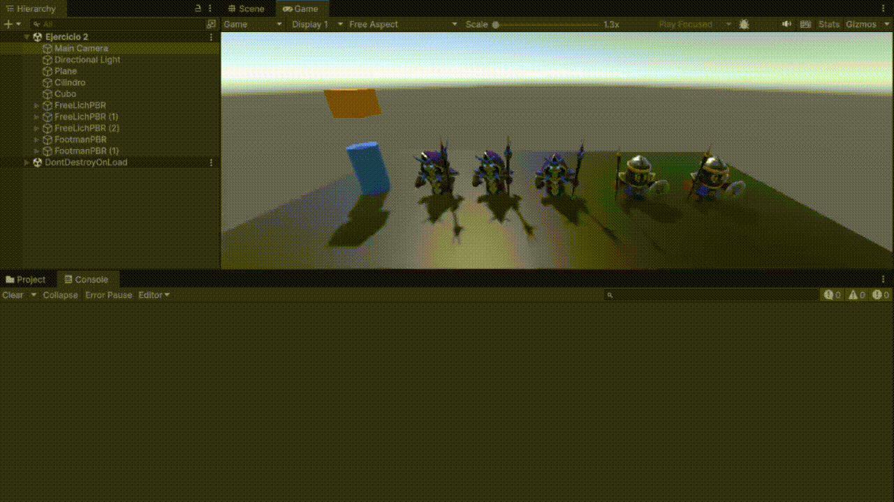
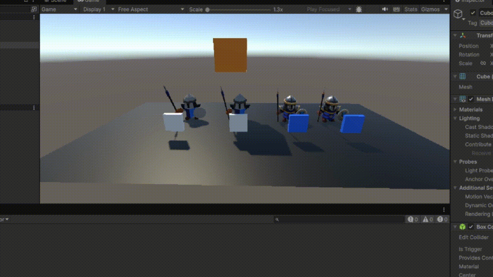
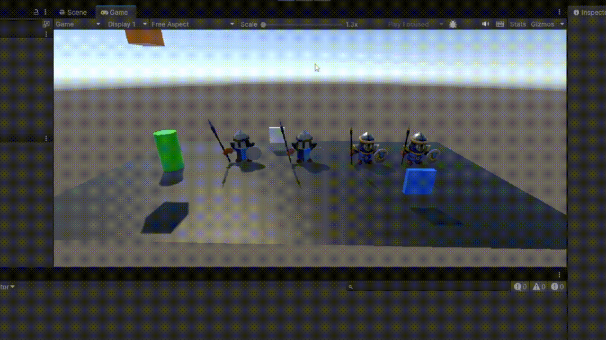
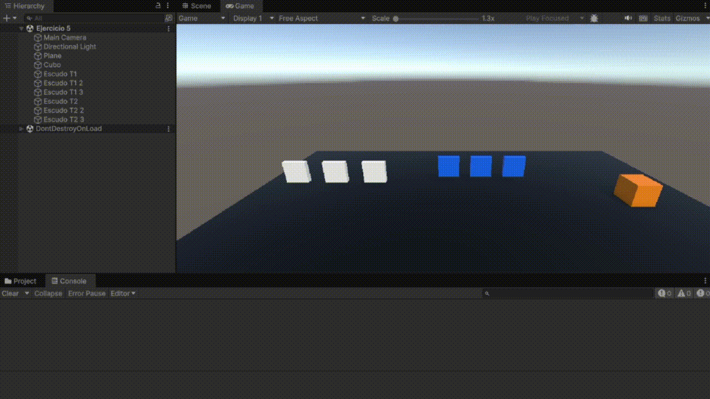
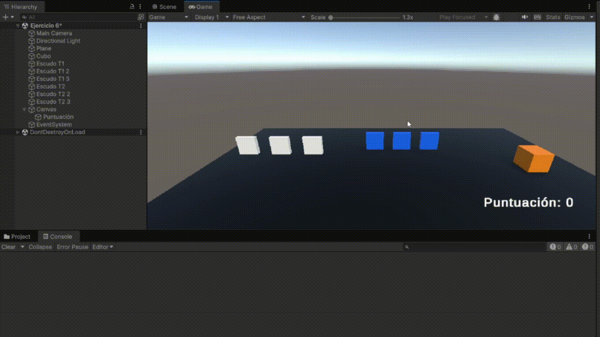
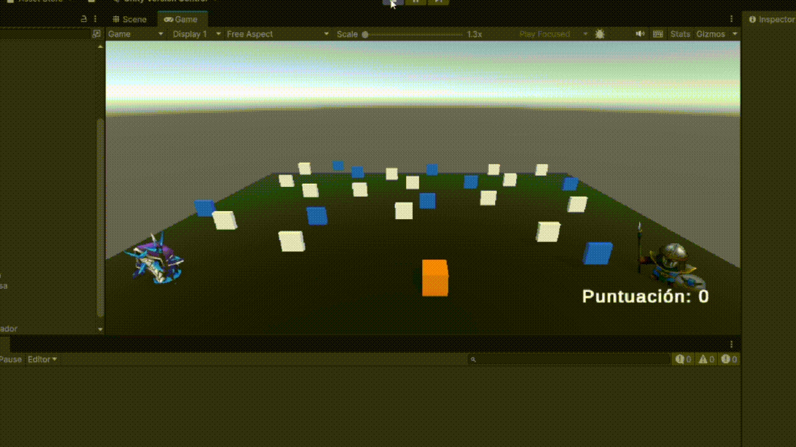

# Interfaces Inteligentes
## Práctica 4. Delegados, Eventos
### Alumna: Nailea Fayna Cruz Galván (alu0101477497)

**Descripción:**
En esta práctica se ha propuesto realizar una serie de tareas básicas con el objetivo de aprender como funcionan los eventos en Unity, además de aprender el patrón Observer y el tipo delegados. En este fichero, explicaré dichas tareas y cómo las llevé a cabo.

### Ejercicios
---

1. **Crea una escena con 5 esferas: rojas que las etiquetas de tipo 1, y verdes de tipo 2. Añade un cubo y un cilindro. Crea la siguiente mecánica: cuando el cubo colisiona con el cilindro, las esferas de tipo 1 se dirigen hacia una de las esferas de tipo 2 que fijes de antemano y las esferas de tipo 2 se desplazan hacia el cilindro.**

En este ejercicio creé una escena con un cubo, un cilindro y varias esferas divididas en dos tipos (2 rojas y 3 verdes). El cilindro detecta cuándo el cubo choca con él y envía un mensaje a todas las esferas. Cuando eso pasa: las esferas del tipo 1 se mueven hacia una esfera del tipo 2, y las del tipo 2 se mueven hacia el cilindro. Todo se controla con los scripts [ControladorCilindro](Scripts/ControladorCilindro.cs) (el que que lanza el evento detectando cuando el cubo colisiona) y [ControladorEsferas](Scripts/ControladorEsferas.cs) (el que hace que las esferas reaccionen cambiando su posición).

2. **Sustituye los objetos geométricos por [humanoides que encontrarás en el enlace](https://assetstore.unity.com/packages/3d/characters/humanoids/fantasy/mini-legion-footman-pbr-hp-polyart-86576) y en [este enlace](https://assetstore.unity.com/packages/3d/characters/humanoids/fantasy/mini-legion-lich-pbr-hp-polyart-91497)**

No cambié nada de la lógica de programa, únicamente sustituí las esferas rojas por FootmanPBR y las verdes por FreeLichPBR.

3. **Adapta la escena anterior para que existan humanoides de tipo 1 y de tipo 2, así como diferentes tipos de escudos, tipo 1 y tipo 2:**
**Cuando el cubo colisiona con cualquier humanoide  tipo 2,  los del grupo 1 se acercan a un escudo seleccionado. Cuando el cubo toca cualquier humanoide del grupo 1 se dirigen hacia los escudos del grupo 2 que serán objetos físicos. Si algún humanoide a colisiona con uno de ellos debe cambiar de color.**

En caso, añadí 2 humanoides de cada tipo y añadí también 2 escudos de dos tipos. Para lograr lo que se pide cree el script [ControladorEscudos](Scripts/ControladorEscudos.cs), que es el que está en el cubo y detecta con qué tipo de humanoide colisiona, enviando un mensaje al resto. El script [ControladorHumanoides](Scripts/ControladorHumanoides.cs) escucha ese mensaje y hace que los humanoides se muevan hacia su escudo correspondiente. También cambia el color del modelo cuando uno toca un escudo, usando el evento `OnTriggerEnter`.

4. **Cuando el cubo se aproxima al objeto de referencia, los humanoides del grupo 1 se teletransportan a un escudo objetivo que debes fijar de antemano.Los humanoides del grupo 2 se orientan hacia un objeto ubicado en la escena con ese propósito.**

El [ControladorTeletransporte](Scripts/ControladorTeletransporte.cs) hace que el cubo detecte la distancia con el objeto de referencia y, cuando se cumple la condición, se encarga de mover directamente a los humanoides de tipo 1 al escudo que tienen asignado y de orientar a los de tipo 2 hacia su escudo. El [ControladorHumanoides](Scripts/ControladorHumanoides.cs) realmente no cambia, ya que aquí toda la acción la controla el cubo.

5. **Implementar la mecánica de recolectar escudos en la escena que actualicen la puntuación del jugador. Los escudos de tipo 1 suman 5 puntos y los de tipo 2 suman 10. Mostrar la puntuación en la consola.**

El cubo tiene el script [PuntuacionEscudos](Scripts/PuntuacionEscudos.cs), que se encarga de detectar cuándo pasa por encima de un escudo. Cada vez que recoge uno, se muestra la puntuación total por consola y el escudo desaparece. El cubo también usa el script [PlayerMovement](Scripts/PlayerMovement.cs) de la práctica anterior.

6. **Partiendo del script anterior crea una interfaz que muestre la puntuación que va obteniendo el cubo.**

Para este ejercicio añadí una interfaz para mostrar la puntuación directamente en pantalla (gracias a Canvas). En este caso el cubo usa el script [PuntuacionEscudosCanvas](Scripts/PuntuacionEscudosCanvas.cs), que hace lo mismo que el anterior pero además actualiza el texto del Canvas cada vez que se recoge un escudo. Este texto se muestra en la parte de abajo de la pantalla y se va actualizando automáticamente con la puntuación total del jugador.

7. **Partiendo de los ejercicios anteriores, implementa una mecánica en la que cada 100 puntos el jugador obtenga una recompensa que se muestre en la UI.**

Este ejercicio es muy similar al anterior. Esta vez creamos para el cubo el script [Contador100](Scripts/Contador100.cs), que sigue contando los puntos igual que antes, pero ahora cada vez que el jugador llega a 100 puntos (o múltiplos) aparece un mensaje avisando de que ha ganado una recompensa. El texto se muestra 3 segundos en pantalla y luego desaparece.

8. **Genera una escena que incluya elementos que se ajusten a la escena del prototipo y alguna de las mecánicas anteriores**

Para este ejercicio entendí que debíamos hacer una mezcla de las mecánicas que hemos aprendido. Mezclé lo del **contador y recompensas** del ejercicio anterior (el 7) con el **teletransporte de humanoides** del ejercicio 4. Ahora la escena tiene dos humanoides, uno de cada tipo. Cuando el jugador se acerca a un escudo de cierto tipo, el humanoide de ese mismo tipo se teletransporta automáticamente a la posición de dicho escudo. Los humanoides son objetos físicos con **Rigidbody** y **Colliders**, así que interactúan correctamente con la física del juego. Esto podría ser interesante para un prototipo, ya que podríamos imaginar que los humanoides están "defendiendo" los escudos o reaccionando a la presencia del jugador.

El cubo sigue usando el script [Contador100](Scripts/Contador100.cs) para gestionar la puntuación y las recompensas. Además, hay un objeto vacío llamado **Teletransportador** que contiene el script [TeletransporteEscena](Scripts/TeletransporteEscena.cs), encargado de manejar los teletransportes de todos los humanoides según la cercanía a los escudos.

