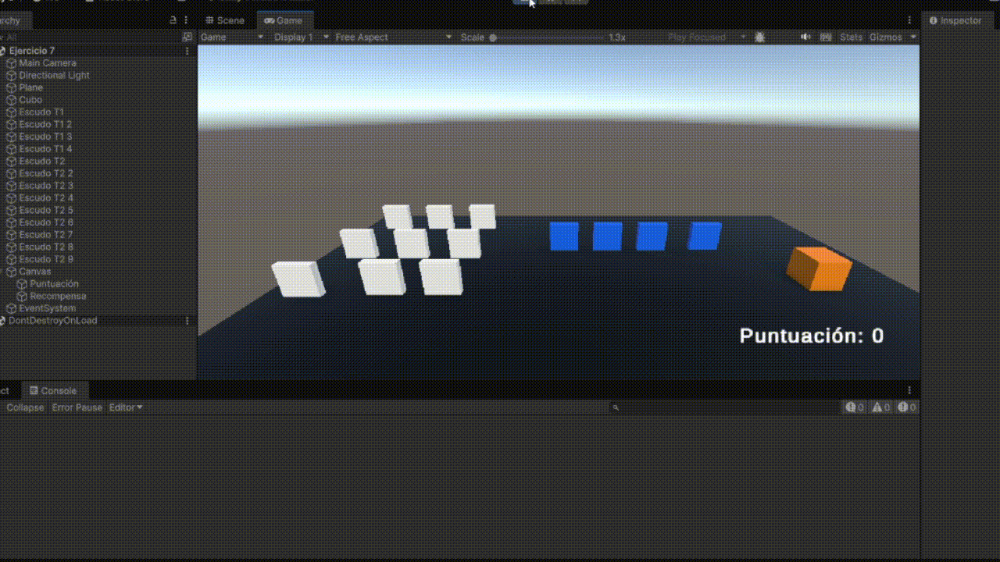

# Interfaces Inteligentes
## Práctica 4. Delegados, Eventos
### Alumna: Nailea Fayna Cruz Galván (alu0101477497)

**Descripción:**
En esta práctica se ha propuesto realizar una serie de tareas básicas con el objetivo de aprender como funcionan los eventos en Unity, además de aprender el patrón Observer y el tipo delegados. En este fichero, explicaré dichas tareas y cómo las llevé a cabo.

### Ejercicios
---

1. **Crea una escena con 5 esferas: rojas que las etiquetas de tipo 1, y verdes de tipo 2. Añade un cubo y un cilindro. Crea la siguiente mecánica: cuando el cubo colisiona con el cilindro, las esferas de tipo 1 se dirigen hacia una de las esferas de tipo 2 que fijes de antemano y las esferas de tipo 2 se desplazan hacia el cilindro.**

2. **Sustituye los objetos geométricos por [humanoides que encontrarás en el enlace](https://assetstore.unity.com/packages/3d/characters/humanoids/fantasy/mini-legion-footman-pbr-hp-polyart-86576) y en [este enlace](https://assetstore.unity.com/packages/3d/characters/humanoids/fantasy/mini-legion-lich-pbr-hp-polyart-91497)**

3. **Adapta la escena anterior para que existan humanoides de tipo 1 y de tipo 2, así como diferentes tipos de escudos, tipo 1 y tipo 2:**
**Cuando el cubo colisiona con cualquier humanoide  tipo 2,  los del grupo 1 se acercan a un escudo seleccionado. Cuando el cubo toca cualquier humanoide del grupo 1 se dirigen hacia los escudos del grupo 2 que serán objetos físicos. Si algún humanoide a colisiona con uno de ellos debe cambiar de color.**

4. **Cuando el cubo se aproxima al objeto de referencia, los humanoides del grupo 1 se teletransportan a un escudo objetivo que debes fijar de antemano.Los humanoides del grupo 2 se orientan hacia un objeto ubicado en la escena con ese propósito.**

5. **Implementar la mecánica de recolectar escudos en la escena que actualicen la puntuación del jugador. Los escudos de tipo 1 suman 5 puntos y los de tipo 2 suman 10. Mostrar la puntuación en la consola.**

6. **Partiendo del script anterior crea una interfaz que muestre la puntuación que va obteniendo el cubo.**

7. **Partiendo de los ejercicios anteriores, implementa una mecánica en la que cada 100 puntos el jugador obtenga una recompensa que se muestre en la UI.**

8. **Genera una escena que incluya elementos que se ajusten a la escena del prototipo y alguna de las mecánicas anteriores**

